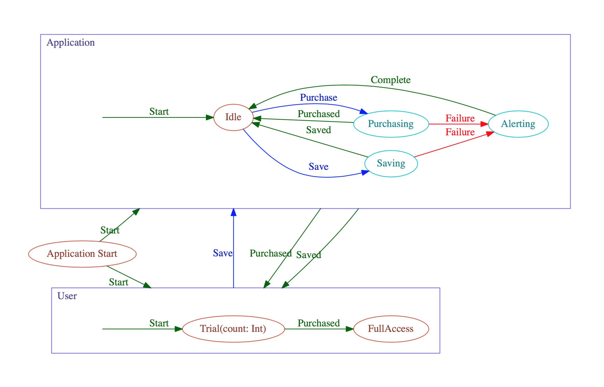

# SwiftReferenceApp

An attempt to unify StateMachine, Tasks, Reactive, ViewModel and Binding patterns for a Swift/iOS app reference design.

The image below was generated from the `.dot` representions of the `App` and `User` classes using `SwiftyStateMachine`'s `GraphableSchemas`, and manually composed into the `ApplicationSchema.dot` file using subgraphs. One potential role of this project is to compose a hierarchical state machine and have `ApplicationSchema.dot` fully generated by the implementation.

